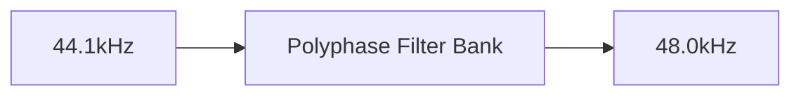

# ASRC Resampler


## Overview
Asynchronous Sample Rate Converter in Go. Implements a Kaiser-windowed sinc interpolator with continuously variable ratio support.

Designed strictly for high-performance integrations and infrastructure codebases. No redundant abstractions; focuses entirely on precise data processing.

## Architecture



## Requirements
- **Go**: Latest stable toolchain.
- **OS Support**: Cross-platform (macOS/Linux prioritized).
- **Dependencies**: Minimal to none (strictly constrained to standard library where mathematically possible).

## Quick Tutorial

Integration is straightforward. Consult the module source for exact API signatures.

```go
// 1. Initialize the primary component
// 2. Supply the required I/O interfaces or buffers
// 3. Execute the processing loop or listener
```
## Testing, Fuzzing, and Benchmarking

To run the test suite and benchmarks:
```bash
go test -v ./...
go test -bench .
```

To run the fuzzer:
```bash
go test -fuzz=Fuzz -fuzztime=10s
```
