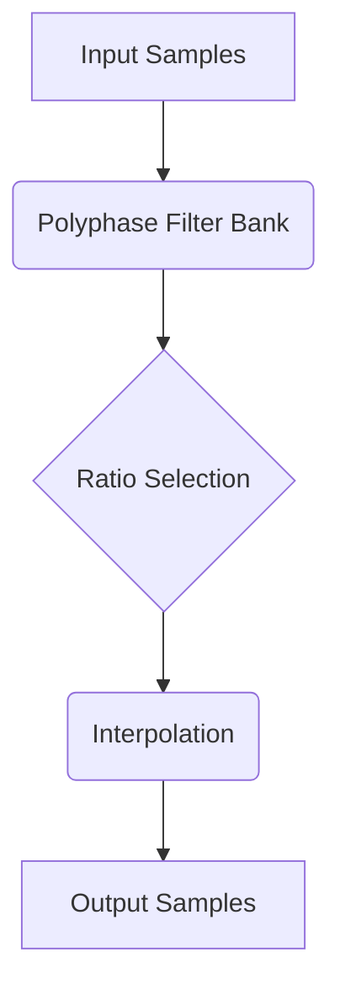

# asrc-resampler-narechia


## Overview
Kaiser-windowed sinc resampler with continuously variable ratio and 4 quality levels.

## Architecture



## Interface
```go
// Core exported structs, traits, or functions
```

## Agent Handoff / Continuation
Copied asrc.go. Need to rename package, add quality comparison benchmarks.
